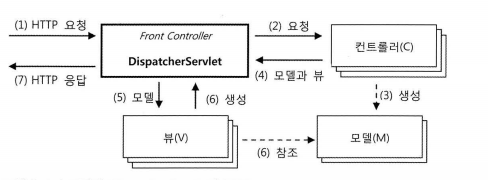

DispatcherServlet
-----------------
* 흐름

1. HandlerMapping
    > URL과 요청 정보 기준으로 어떤 핸들러 오브젝트, 즉 컨트롤러를 사용할것인지  결정하는 로직을 담당한다.
2. HandlerAdapter
3. HandlerExceptionResolver
4. ViewResolver
5. LocaleResolver
6. ThemeResolver
7. RequestToViewNameTranslator
